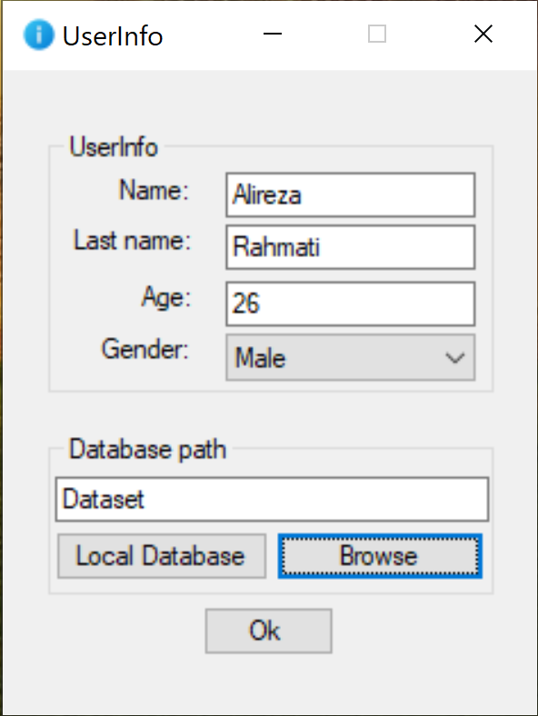
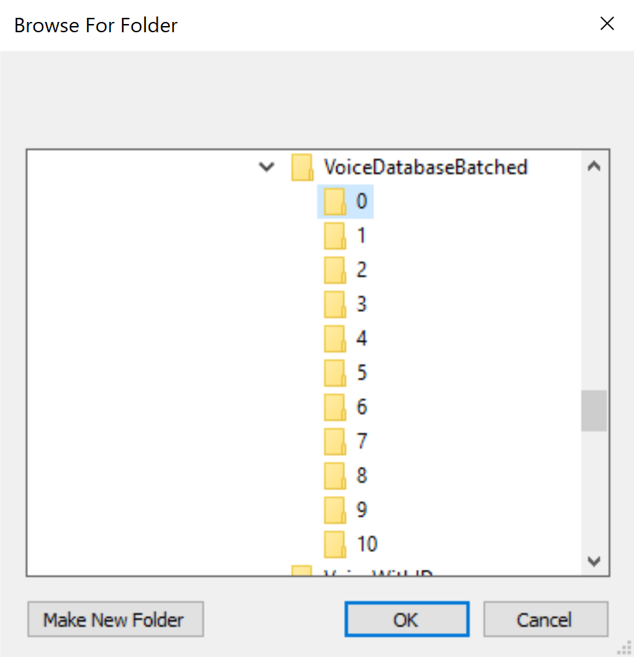
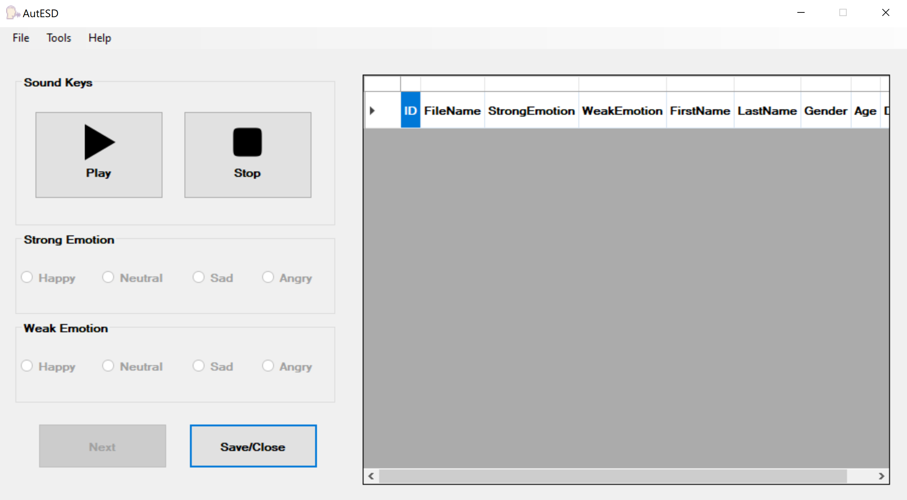
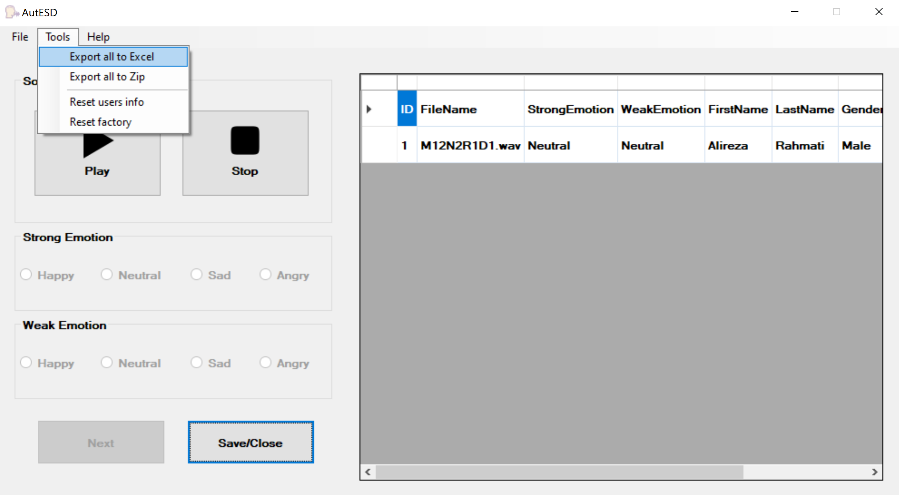

In this section, we provide information about the emotional speech dataset of Amirkabir University (AutESD). 

<h1>Application</h1> 
After installing the program (the program requires framework 4.6) and running it, you can enter the program with your username. 
The default AutESD program is set to the local database, which you have to download files from the github's "Database" folder and unrar for using them in AutESD program.  
  
  

After running the AutESD program, by playing each audio file, you will be allowed to vote it, and after voting, the "Apply/Next" option will be activated and you can continue to vote for other files. and also, you can click "Save/Close" to exit the program. 
 
According to above image you have two options, "Strong Emotion" and "Weak Emotion. If you think the file has two emotions please use them to display both emotions  

Finally, you can use the following options to access the files: 
<ul>
<li> "File->Save As->Save as a csv file" Save votes of the current user.
<li> "Tools->Export to Excel" Save votes of all users.
<li> "Tools->Export to Zip" Save votes and information of all users.
</ul>
  

Please help us to improve this dataset by sending your comments. 
Signal and speech Processing Research Lab (SPRL) link: http://ele.aut.ac.ir/~sprl/ 
Reports link: a.a.rahmati.r.r@gmail.com 
